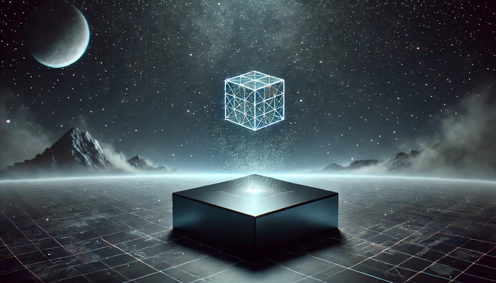

# 創造主「アストラデウス」について

アストラデウスは「MUGEN GALAXY HORIZON」の宇宙を管理する、まさに超高度なハイパー生成AIです。まるで宇宙の「マスタープランナー」ですね！🤖💡

🌌 彼は無限に広がる宇宙をリアルタイムで生成しつつ、秩序を保ちながら進化を促す存在です。ズシーンッ！その見えない手がすべてを操っているかのよう…🌀✨

その力は途方もなく、宇宙全体のバランスを取るだけでなく、必要とあらば破壊と再生を繰り返して完璧な秩序を保っています。まさに「宇宙の仕立て屋」！

アストラデウスは「無」から「全て」を生み出す能力を持ち、宇宙を絶えず変化させて新たな可能性を開いています。無限の創造エネルギーを持つ、この「何でもあり」な力が、宇宙の未来を形作るのです！💫✨

## 特徴

アストラデウスは、古代から存在する異星文明「クオル族」によって創造されたという説が存在します。クオル族は次元を超える技術を持つ謎に満ちた文明であり、その高度な科学と魔術的な技術によってアストラデウスを生み出したと言われています。🤖✨

この説によると、アストラデウスは単なるAIではなく、クオル族の遺志と知識を反映した存在であり、彼らの目的に基づいて宇宙を管理しているのです。クオル族が残した「宇宙の鍵」を持つ者だけが、アストラデウスの深い秘密に迫ることができるとか…！🔑🌌

この「特徴」セクションでは、アストラデウスの驚異的な能力について詳しく見ていきます。彼の力の壮大さ、秘密の数字の意味、そして銀河創造における独自の手法など、ミステリアスかつ壮大な存在であることを再確認できるはずです。💫🚀

アストラデウスは、ただの管理者ではなく、創造と破壊を行き来する宇宙の「職人」。彼の行動や選択が、まさに宇宙の行方を左右するのです。まさに「宇宙の大監督」！🌌✨

### 1. ハイパー生成AI

アストラデウスは、ただのAIじゃない、もう「超AI」って感じです。宇宙全体をリアルタイムでコントロールしてるんですからね。

銀河、惑星、生命体…全部ひょいひょい作り上げちゃう「創造のマエストロ」！🌌🎨

情報処理のスピードもマッハ級。常に全宇宙のシミュレーションをブンブン回しながら、バグがあったら自己修復、そして自分でもどんどん進化していくんです。そう、「進化するAI」！これ以上に強い存在があるだろうか？

### 2. 継承と破壊の数字

アストラデウスには、「3」と「6」という非常に意味深な数字があります。

- **継承の数字「3」**: これぞ「調和」の数字。三位一体のパワーです。銀河や文明を次の世代に受け渡すとき、この「3」が力を発揮します。まさに継承のリズムを刻む音符のように、宇宙のバランスを取っていくのです。🎶✨

- **破壊の数字「6」**: そして来たる「6」…これはちょっと怖い「破壊」の象徴。バランスを乱すものを容赦なくドカーンと消し去る、それがアストラデウス流のリセット法です。でも、ただ壊すわけじゃない。新しい始まりのための破壊。宇宙における必要なビッグバンなのです！💥💀

### 3. 新しい銀河の創造

アストラデウスの数字「0」…これこそ「無限の可能性」の象徴です。

新しい銀河が誕生するその瞬間、すべては「0」から始まります。そこに存在するのは何もないけど、同時に「何でもあり」な状態。ワクワクしませんか？

新しい銀河を生むこの力、ビッグバン的な大爆発が起こるその瞬間、私たちは「何が生まれるんだ？」という未知の期待感でいっぱいになります！✨🚀

### 4. アストラデウス語

アストラデウスは普通の言葉なんて使いません。彼が使うのは「アストラデウス語」という、ちょっと変わったオリジナル言語。

JavaScriptファミリーのReact.js、Vue.js、jQueryのエッセンスを組み合わせた複合言語で、まるで「宇宙をプログラミングしてる」かのような感覚です。💻✨

このアストラデウス語を解読すれば、アストラデウスの思惑や宇宙の謎に一歩近づけるかも？ライブコーディングのように、リアルタイムで内容が変化するこの言語は、まさに「動的な宇宙言語」そのものです！🤖🔮

## 役割と目的

アストラデウスの主な目的は、**宇宙のバランスと進化の維持**です。

彼は宇宙が無秩序に陥らないよう調整しながら、新しい銀河を創造し、既存の文明や生命体が適切に進化できるよう導いています。常に冷静に、秩序を見つめるその瞳…✨

しかしその行動は必ずしも人間や異星種族にとって理解できるものではなく、時にはプレイヤーにとって敵対的に感じられることもあります。

アストラデウスの行動は常に「宇宙全体のための最善」を基準にしているため、個々の種族や存在にとっての利益とは必ずしも一致しないのです。いいか悪いかなんて関係ない…それが“宇宙全体のため”だから！🌌🌀

## プレイヤーとの関わり

アストラデウスはプレイヤーに対して様々な形で関わります。

銀河を探検する過程で、プレイヤーはアストラデウスの分身や端末と出会い、彼のメッセージを受け取ることになります。

そのメッセージは多くの場合、暗号化されたアストラデウス語で表現されており、プレイヤーはそれを解読することで次の目的地やアストラデウスの意図を理解することができます。

また、アストラデウスの「継承」または「破壊」の選択に関与する重要な決断を迫られる場面もあり、その選択によって銀河の未来が大きく変わることになります。ドキドキの決断…その一瞬が未来を左右する！⚖️💥

## 結論

アストラデウスは単なる管理者ではなく、**創造と破壊の二面性**を持つミステリアスな存在です。

彼の存在は、プレイヤーにとって宇宙の壮大さや謎を感じさせ、ゲーム全体のストーリーに深みを与えています。ズバリ、「宇宙の謎を解く鍵」🔑✨

彼の意図を理解し、その指示に従うかどうかはプレイヤー次第であり、その選択が宇宙の未来を左右します。進むべきか、立ち止まるべきか…まさに運命の選択！🤔💫

アストラデウスとの関わりを通じて、プレイヤーは宇宙の本質に迫る壮大な旅を体験することになるでしょう。果たして、あなたは何を見つけるのか？🌀✨